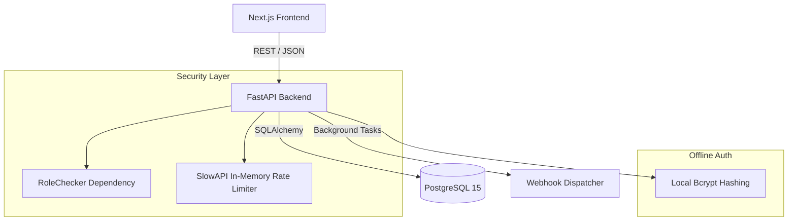

# System Architecture

## Overview
The Dogfood 2026 platform is designed strictly for offline-first, self-hosted environments. The architecture prioritizes zero external dependencies, robust data integrity, and strict role isolation, ensuring fair and auditable hackathon judging.

## 🏗 Component Diagram

## 🛠 Technical Decisions

### 1. API-First Design (FastAPI)
We chose Python and FastAPI for the backend. 
*   **Why?** It automatically generates OpenAPI specifications (`swagger.yaml`), fulfilling the T4 Bonus. It also allows BHAVA's algorithms (Z-score normalization) to be written natively in Python.

### 2. Role-Based Access Control (RBAC)
Role isolation is enforced strictly at the middleware layer using FastAPI Dependency Injection.
*   **Why?** If a `PARTICIPANT` attempts to call an `ORGANIZER` endpoint (e.g., viewing hidden judge data), the request is dropped with a `403 Forbidden` before it even reaches the core business logic.

### 3. Single-Command Boot (Docker)
The entire stack (DB, Backend, Frontend) is bundled in a single `docker-compose.yml`.
*   **Why?** It ensures operators can spin up the event environment perfectly, offline, and reliably, fulfilling the strict adoption requirements. We also implemented a `seed.py` ingestion script to auto-hydrate the DB with fixture data.

### 4. Cryptographic Auditability
Instead of generating heavy PDFs offline, Judge Participation Records are generated as JSON blobs and signed using **HMAC-SHA256**. This proves authenticity mathematically without relying on third-party PDF generators.
